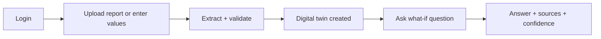
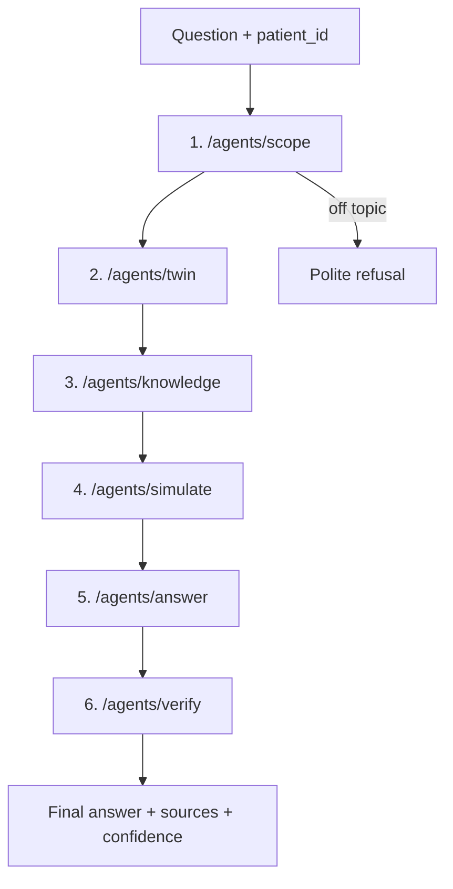

# MedTwin – Team Build Guide

*Digital twin for adults with Type 2 Diabetes, built on Azure. Educational demo only, not for real clinical decisions.*

## 1. The idea in 4 bullets
- A patient uploads their lab values (or types them in). The system turns them into a **digital twin**: a saved profile with each value marked "at goal" or "needs attention" (based on the guidelines).
- The patient asks questions, including "what if" questions ("what if my HbA1c stays high for 6 months?").
- Answers use **the patient's own numbers + a trained ML risk score + official guideline passages (RAG)**.
- Every answer is checked by a Verifier and shown with sources and a confidence score.

**Scope statement (put it in the README and the UI):** *Trained on U.S. adults diagnosed with diabetes at age 30 or older (a proxy for Type 2). Not for Type 1 or early-onset diabetes.*

## 2. Who does what (the most important idea)
**Machine learning model (scikit-learn)**
- Learns from thousands of real patients (NHANES).
- Output: a risk score (chance this patient's HbA1c is above 7%) plus a **percentile per value** ("higher than 82% of adults with diabetes in the data").
- It does NOT answer questions, write text, or judge whether a value is "good". A common value can still be above target.
- Runs on your laptop; saved as `risk_model.joblib`.

**LLM (Azure OpenAI model deployed in Foundry)**
- Reads text and writes text. Never invents medical facts.
- Jobs: extract values from a report into JSON, judge "is this on topic", write the answer, check the answer.
- Gets the patient's twin + ML score + retrieved guideline passages in every prompt.

**LLM + guideline search (decides "is this number OK?")**
- For each uploaded value, the Knowledge step retrieves the guideline target (ADA/NICE). The LLM labels it "at goal" or "needs attention" and quotes the passage.
- The medical judgment comes from the guidelines, not from us and not from a rule we invented.

**Plain Python (no medical opinions)**
- Only unit conversion (mg/dL vs mmol/L) and sanity checks (a BP of 900 is a typo).

**Why the twin feels personal:** the patient's data is put into every prompt by our code. It is not stored inside any model.

## 3. User flow



## 4. Agent chain (every agent is a FastAPI endpoint)



**How forwarding works:** one shared JSON `state` travels down the chain. Each endpoint reads it, adds its own result, and posts it to the next endpoint. The last one returns the final answer, which flows back to the caller.

```python
import httpx
BASE = "http://localhost:8000"

@app.post("/agents/scope")
def scope(state: dict):
    state["on_topic"] = ask_llm(SCOPE_PROMPT, state["question"]).strip().lower() == "yes"
    if not state["on_topic"]:
        return {"answer": "I only handle Type 2 Diabetes questions.", "confidence": None}
    return httpx.post(f"{BASE}/agents/twin", json=state, timeout=60).json()
```
Every other agent follows the same pattern with a different job and a different next URL.

### Agent 1: `/agents/scope` (LLM)
- Input: `question`. Output: `on_topic` (yes/no).
- Refuses anything not about Type 2 Diabetes ("I have a cough").
- If yes, forwards to `/agents/twin`.

### Agent 2: `/agents/twin` (plain Python)
- Input: `patient_id`. Loads the saved twin JSON (values, high/low flags, ML risk score).
- Adds `twin` to the state. No LLM needed.
- Forwards to `/agents/knowledge`.

### Agent 3: `/agents/knowledge` (Azure AI Search)
- Searches the guideline index using the question plus the patient's flagged values.
- Adds the top 3–5 passages as `sources` (text + document name + page).
- Forwards to `/agents/simulate`.

### Agent 4: `/agents/simulate` (ML model + rules)
- For "what if" questions, changes the relevant twin value (for example HbA1c or BMI) and re-runs the ML model.
- Adds `projection` (old score vs new score) and labels it "estimate from population patterns, not a forecast".
- Forwards to `/agents/answer`.

### Agent 5: `/agents/answer` (LLM)
- Input: question, twin, sources, projection, `mode` (patient = simple words, clinician = technical).
- Writes the answer using ONLY the supplied numbers and passages. If sources don't cover it, it says so.
- Forwards to `/agents/verify`.

### Agent 6: `/agents/verify` (LLM)
- Splits the draft into claims and checks each one against the sources and twin.
- Removes or rewrites unsupported claims and computes `confidence` = share of claims supported.
- Returns the final `{answer, sources, confidence}`.

## 4b. Other endpoints
| Endpoint | Job |
|---|---|
| `POST /auth/login` | Simple demo login (username + stored password/hash). Azure Entra ID is overkill for this deadline |
| `POST /twin/upload` | Save the file to Blob, read the text (`pypdf` or CSV), LLM returns JSON, validate units, guideline search + LLM label each value (at goal / needs attention), ML gives risk score + percentiles, save the twin |
| `GET /twin/{id}` | Return the twin for the summary panel |
| `POST /chat` | Entry point. Builds the state and calls `/agents/scope` |
| `POST /speech/transcribe` | Audio in, text out (Azure Speech-to-Text) |
| `POST /speech/speak` | Text in, audio out (Azure Text-to-Speech) |

## 5. Dataset (real data)
- **Source:** NHANES, the CDC's national health survey with real exams and lab tests. Home: https://cdc.gov/nhanes. Use the 2017–March 2020 pre-pandemic files. Each has a page like https://wwwn.cdc.gov/Nchs/Data/Nhanes/Public/2017/DataFiles/P_GHB.htm with the download link.
- **Files (join on `SEQN`):** `P_DEMO`, `P_GHB`, `P_BPXO`, `P_BMX`, `P_TCHOL`, `P_HDL`, `P_BIOPRO`, `P_DIQ`.
- **Keep:** adults with diagnosed diabetes and age at diagnosis 30 or older, complete rows only.
- **Features:** age, sex, BMI, systolic BP, diastolic BP, total cholesterol, HDL, creatinine, on insulin (0/1).
- **Label:** HbA1c 7 or above = 1, else 0. **Never put HbA1c in the features** (that is leakage).
- Variable names are from memory. Check each file's Codebook page (`RIDAGEYR`, `RIAGENDR`, `BMXBMI`, `BPXOSY1`, `BPXODI1`, `LBXTC`, `LBDHDD`, `LBXSCR`, `DIQ050`, `DID040`, `DIQ010`, `LBXGH`).
- **Limit to state openly:** it's a survey snapshot in time, so "what-if" results are estimates.

## 6. Training the ML model
- **Where:** Google Colab or a laptop. NOT Azure (no extra cost, nothing new to learn).
- **Method:** Random Forest (300 trees, `min_samples_leaf=5`), with Logistic Regression as a baseline. 80/20 split plus 5-fold cross-validation.
- **Accuracy metric:** ROC-AUC. Expect roughly **0.65–0.80** (estimate). **0.95 or higher means a bug**, usually HbA1c leaking into the features.
- **Time:** about 4–6 hours for a beginner team. Downloading, merging and cleaning take most of that; training takes seconds.
- **Output:** `risk_model.joblib` (loaded once at FastAPI start) + a short results note (AUC, feature list, row count).
- **Also save** the training table (`reference.csv`). Percentile = `scipy.stats.percentileofscore(reference["sbp"], patient_sbp)`. Because HbA1c is the label, its target check comes from the guidelines, not from the model.

## 7. Azure setup (about 2–3 hours, one person, do this first)
1. Portal (portal.azure.com): create resource group `medtwin-rg`. Cost Management: create a budget alert (for example $30 and $70) **before anything else**.
2. Foundry (ai.azure.com): create a project in that group.
3. Deploy a cheap chat model (a "mini" class one if available) and an embedding model. Note both **deployment names**.
4. Copy endpoint + key into `.env`. Add `.env` to `.gitignore`. Never push keys.
5. Create a Storage account (Standard, LRS), containers `guidelines` and `uploads`. Upload the guideline PDFs.
6. Create Azure AI Search (Basic or Free). Use the **Import and vectorize data** wizard on the `guidelines` container with your embedding deployment.
7. Create a Speech resource and copy its key and region.
8. Available models depend on region and account. If your first choice is missing, pick the closest.

## 7b. Medical sources (where the "facts" come from)
- **Primary source: ADA Standards of Care in Diabetes—2026**, published in *Diabetes Care* and updated every year by an expert committee of the American Diabetes Association. [Section 6, Glycemic Goals](https://diabetesjournals.org/care/article/49/Supplement_1/S132/163927/6-Glycemic-Goals-Hypoglycemia-and-Hyperglycemic). Also index the sections on drug treatment, cardiovascular risk (BP and cholesterol) and kidney disease (check exact titles on the issue page).
- **Secondary source:** NICE NG28 (https://www.nice.org.uk/guidance/ng28). Guidelines can differ from each other, so ADA is primary and every answer shows which source it used.
- **Example of a real recommendation:** an HbA1c goal below 7% is appropriate for many nonpregnant adults without severe hypoglycemia (ADA 2026, Rec 6.3a). It is a *goal*, not a danger line, and goals are individualized. BP goals were also updated in 2026 (tighter for high-risk patients, more relaxed for most older adults). So targets come from retrieved text, never from numbers we typed in.
- **UI wording:** "above the usual goal of <7% for many adults; your doctor may set a different one". Never "dangerous".
- **Rules:** the answer agent states a medical fact only if it appears in a retrieved passage, and cites the section or recommendation number. If nothing relevant is found it says "I can't find this in the guidelines."
- **Before submitting:** one teammate spot-checks 10–15 answers against the actual ADA text.
- **Reuse:** the content is free to read, but check each site's terms before saving copies. Keep it to a cited class project and don't republish the documents.

## 8. RAG (about 2–3 hours)
- **Does Azure have RAG?** Not as one button. RAG is assembled from Azure AI Search (the index) + an embedding model + your LLM. Do NOT build it from scratch. The wizard builds the index and your code is about 5 lines: search, then paste the passages into the prompt.
- **Documents:** ADA Standards of Care 2026 (primary, see 7b), then NICE NG28, WHO HEARTS-D and the ADA/EASD consensus report as secondary. Free PDFs; links are in the original MedTwin doc.
- **Index:** the Search wizard splits PDFs into chunks and stores the embeddings, so no manual chunking.
- **Query:** in `/agents/knowledge`, use `azure-search-documents`. Start with keyword search (works out of the box), add vector or hybrid later. Field names (`chunk`, `title`) depend on what your wizard created, so check the index in the portal.
```python
from azure.search.documents import SearchClient
from azure.core.credentials import AzureKeyCredential
search = SearchClient(SEARCH_ENDPOINT, INDEX_NAME, AzureKeyCredential(SEARCH_KEY))
passages = [h["chunk"] for h in search.search(search_text=question, top=4)]
```
- **Rule:** the answer agent may only use those chunks for medical facts.

## 9. Speech-to-speech (about 2–3 hours, build last but do build it)
- Mic recording in Streamlit (`st.audio_input`) goes to `/speech/transcribe` (Azure Speech-to-Text).
- The text goes to `/chat`, which runs the whole chain.
- The answer goes to `/speech/speak` (Text-to-Speech) and plays with `st.audio`.
- Use the `azure-cognitiveservices-speech` package with the Speech key and region.

## 10. Frontend (Streamlit, about 5–6 hours)
- **Pages:** Login, Upload/Enter values, Twin summary (values with high/ok/low badges + risk score), Chat.
- **Chat shows:** the answer, a "Sources" expander, a confidence bar, a patient/clinician mode toggle, a mic button.
- Start with mock JSON so the UI doesn't wait for the backend.

## 11. The two "accuracy" numbers (don't mix them up)
- **Model accuracy (AUC):** measured once on held-out NHANES data. It tells how good the risk score is.
- **Answer confidence:** measured per answer by the Verifier: the share of claims backed by sources and the twin. It does NOT mean medical correctness.

## 12. Task split and schedule
| Person | Tasks | Ready by |
|---|---|---|
| A | Section 5–6: data, training, `risk_model.joblib` | Tue night |
| B | Section 7, then 8 (Azure, RAG), then 9 (speech) | Azure keys by Tue noon |
| C | Section 4 and 4b: FastAPI, agent chain, `/twin/upload` | Chain working Wed |
| D | Section 10: Streamlit frontend, flow, mic button | Mock UI Tue, connected Wed |

- **Tuesday:** everyone agrees on the twin JSON and endpoint names, then works in parallel.
- **Wednesday:** connect the UI to the backend, chain all agents, add the Verifier, add speech.
- **Thursday morning:** buffer only. Test 10–15 questions, fix bugs, write the README, record the demo video.
- **Cut order if late:** PDF extraction (use manual entry), then UI polish. Never cut the model, RAG or the agent chain.

## 13. Repo layout
```
medtwin/
  backend/  main.py  agents/  model/risk_model.joblib  .env (not in git)
  frontend/ app.py
  training/ train_model.ipynb
  README.md
```
Packages: `fastapi uvicorn httpx openai azure-search-documents azure-storage-blob azure-cognitiveservices-speech scikit-learn pandas joblib pypdf streamlit`

## 14. Responsible AI notes
- Educational demo only; not medical advice or diagnosis.
- Scope is stated openly (Section 1). The what-if outputs are labeled estimates.
- Use dummy or sample reports in the demo. Don't upload real personal health records.
- Every answer is grounded in guideline passages, or it says it can't answer.
