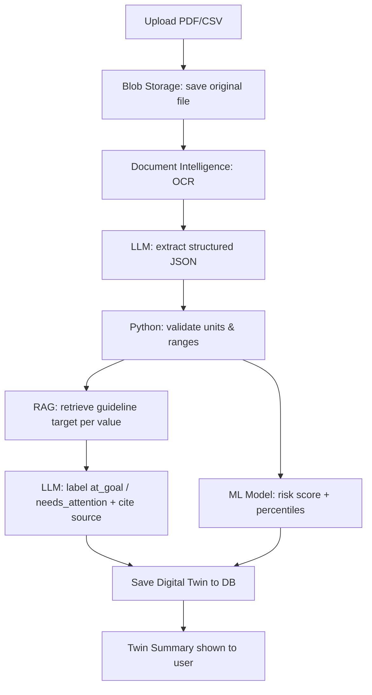
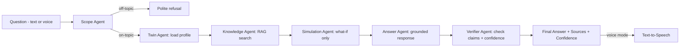
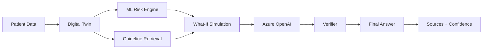
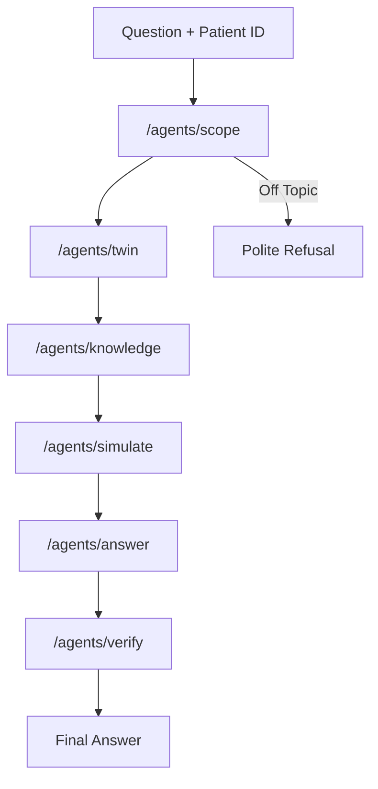
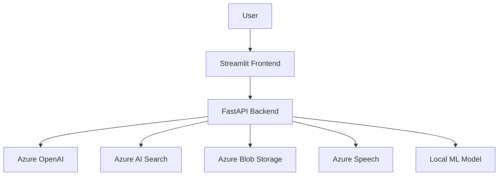

# MedTwin

### AI-Powered Digital Twin for Type 2 Diabetes

> **Personalized health insights powered by a patient digital twin, machine learning, guideline-grounded RAG, and Azure AI.**

MedTwin is an educational AI system that creates a **digital twin of an adult with Type 2 Diabetes** from their health and laboratory values.

The system combines the patient's own data with a trained **machine learning risk model** and **retrieved medical guideline passages** to answer personalized questions, including **"what-if" scenarios**.

Every generated response passes through a dedicated **Verifier** that checks whether its claims are supported by the patient's data and retrieved sources.

> **Educational Demo Only:** MedTwin is not a medical diagnostic system and must not be used for real clinical decisions.

---

##  What Makes MedTwin Different?

Most health chatbots simply send a question to an LLM.

MedTwin follows a structured pipeline:

```text
Patient Data
     ↓
Digital Twin
     ↓
ML Risk Analysis
     ↓
Guideline Retrieval (RAG)
     ↓
What-if Simulation
     ↓
LLM Response
     ↓
Verifier
     ↓
Answer + Sources + Confidence
```

The LLM does **not** independently decide what a medical value means.

Medical targets are retrieved from authoritative guidelines, while the ML model provides population-based risk estimates.

---

##  Full Project Workflow

This section walks through **everything that happens, end to end**, from the moment a user opens the app to the moment they get an answer.

### Phase 1 — Account Access

```text
1. User opens the Streamlit frontend
2. User signs up (username, email, password) or logs in
3. Credentials are checked against the database
4. Passwords are stored only as bcrypt hashes — never in plain text
5. On success, the user's ID is stored in the session
```

### Phase 2 — Building the Digital Twin (one-time, per report)

```text
1. User uploads a lab report (PDF) or enters values manually
2. The original file is saved to Azure Blob Storage, unchanged
3. Azure AI Document Intelligence (OCR) reads the file
   → returns plain text + tables
   → this step does NOT use an LLM and has no medical understanding
4. An LLM reads ONLY that extracted text (never the original file)
   and fills a fixed JSON schema:
      age, sex, bmi, sbp, dbp, total_chol, hdl,
      creatinine, hba1c, insulin
   → any value not found in the report is left null — never guessed
5. Plain Python code validates the values:
      - fixes/checks units (e.g. mg/dL vs mmol/L)
      - rejects implausible numbers (typos, impossible ranges)
      - NO medical judgment happens here
6. For each value, the system retrieves the matching guideline
   target via Azure AI Search (RAG) and an LLM labels the value:
      ✓ At Goal        or        ⚠ Needs Attention
   citing the exact guideline passage — nothing is invented
7. The trained ML model (Random Forest, trained on NHANES) scores
   the patient's risk of poor glycemic control, and calculates
   percentiles against the reference population
8. All of the above (values + labels + risk score + percentiles)
   is bundled into ONE profile and saved to the database
   → this saved profile IS the digital twin
9. The frontend displays a Twin Summary:
      each value as a tile with a ✓ / ⚠ badge, plus an overall
      risk score and percentile bar
```



### Phase 3 — Answering a Question (every time, text or voice)

```text
1. User types a question, OR speaks it
      → if spoken: Azure Speech-to-Text converts it to text first
2. /chat receives {user_id, question, mode: patient|clinician}
3. Scope Agent   → checks the question is actually about Type 2
                    Diabetes. Off-topic questions are politely
                    declined here and the chain stops.
4. Twin Agent    → loads that user's saved digital twin from the
                    database (their real, stored values)
5. Knowledge Agent → searches the guideline index (Azure AI Search)
                      for passages relevant to the question
6. Simulation Agent → ONLY runs for "what-if" questions.
                       Takes a value (e.g. BMI, weight), simulates
                       a change, and re-runs the ML model to show
                       a before/after risk comparison.
                       Always labeled: "an estimate based on
                       population patterns, not a forecast."
7. Answer Agent  → writes a response using ONLY:
                      - the patient's twin values
                      - the ML risk/percentile output
                      - the retrieved guideline passages
                    Never allowed to invent a medical fact.
8. Verifier Agent → splits the draft into individual claims,
                     checks each one against the sources and the
                     twin, removes anything unsupported, and
                     calculates a confidence score:
                        confidence = supported claims / total claims
9. Final response returned: {answer, sources, confidence}
10. If the question was spoken, the answer is converted back to
    audio via Azure Text-to-Speech and played to the user
```



### Phase 4 — Repeat Use

```text
- The digital twin persists in the database.
- The user can ask unlimited follow-up questions without
  re-uploading their report.
- A new report upload replaces/updates the twin with fresh values.
```

---

## Core Features

### Digital Twin

Creates a structured patient profile containing:

* Age
* Sex
* BMI
* Blood pressure
* Cholesterol
* HDL
* Creatinine
* Insulin status
* HbA1c
* Risk score
* Percentiles
* Guideline-based status

Each value can be marked as:

```text
✓ At Goal
⚠ Needs Attention
```

---

###  Machine Learning Risk Engine

MedTwin uses a **scikit-learn Random Forest model** trained on NHANES data.

The model estimates:

> Probability that HbA1c is ≥ 7%

It also calculates population percentiles for relevant measurements.

Example:

```text
HbA1c Risk Score: 68%

SBP:
Higher than 82% of adults
in the reference population
```

The ML model **does not generate medical explanations** and does not determine whether a value is clinically acceptable.

---

### Guideline-Grounded RAG

Medical information is retrieved from indexed guideline documents using **Azure AI Search**.

The system can retrieve relevant passages from sources such as:

* ADA Standards of Care
* NICE NG28
* WHO HEARTS-D
* ADA/EASD consensus material

The retrieved passages are provided to the answer agent as the factual grounding layer.

If the required information cannot be found in the retrieved sources, the system is designed to say so instead of inventing an answer.

---

### What-If Simulation

Users can ask questions such as:

```text
What if my HbA1c remains high for 6 months?
```

or:

```text
What if my BMI decreases?
```

The simulation layer modifies the relevant digital-twin value and re-runs the ML model.

The result is explicitly presented as:

> **An estimate based on population patterns, not a medical forecast.**

---

### Response Verification

Every generated response goes through a dedicated **Verifier agent**.

The verifier:

1. Splits the response into claims
2. Checks claims against retrieved sources
3. Checks claims against the patient's digital twin
4. Removes or rewrites unsupported claims
5. Calculates a response confidence score

```text
Draft Answer
     ↓
Claim Extraction
     ↓
Source / Twin Verification
     ↓
Unsupported Claims Removed
     ↓
Final Answer
```

---

## System Architecture



---

## Multi-Agent Pipeline

Every agent is exposed through a FastAPI endpoint.



### Agent Responsibilities

| Agent               | Technology      | Responsibility                             |
| ------------------- | --------------- | ------------------------------------------ |
| `/agents/scope`     | Azure OpenAI    | Determine whether the question is on-topic |
| `/agents/twin`      | Python          | Load the patient's digital twin            |
| `/agents/knowledge` | Azure AI Search | Retrieve relevant guideline passages       |
| `/agents/simulate`  | ML + Python     | Run what-if simulations                    |
| `/agents/answer`    | Azure OpenAI    | Generate the grounded response             |
| `/agents/verify`    | Azure OpenAI    | Verify claims and calculate confidence     |

A shared JSON `state` moves through the complete pipeline.

---

## Dataset

The ML model is trained using **NHANES**, the CDC's national health survey.

### Dataset Source

**National Health and Nutrition Examination Survey (NHANES)**

The project uses the **2017–March 2020 pre-pandemic** dataset.

Relevant files include:

```text
P_DEMO
P_GHB
P_BPXO
P_BMX
P_TCHOL
P_HDL
P_BIOPRO
P_DIQ
```

Records are joined using:

```text
SEQN
```

### Population

The project focuses on:

> Adults diagnosed with diabetes at age 30 or older.

This is used as a proxy for Type 2 Diabetes.

### Model Features

```text
Age
Sex
BMI
Systolic BP
Diastolic BP
Total Cholesterol
HDL
Creatinine
Insulin Status
```

### Target

```text
HbA1c >= 7% → 1
HbA1c < 7%  → 0
```

**HbA1c is intentionally excluded from the model features to prevent data leakage.**

---

## Machine Learning

### Primary Model

```text
Random Forest
├── Trees: 300
└── min_samples_leaf: 5
```

### Baseline

```text
Logistic Regression
```

### Evaluation

```text
Train/Test Split: 80/20
Cross Validation: 5-Fold
Metric: ROC-AUC
```

The trained model is exported as:

```text
risk_model.joblib
```

The project also stores a reference dataset used for percentile calculations.

---

## Azure Architecture

MedTwin uses Azure services for AI, search, storage and speech capabilities.



### Azure Components

* **Azure OpenAI / Microsoft Foundry** — LLM capabilities
* **Azure AI Search** — guideline retrieval
* **Azure Blob Storage** — uploaded reports and guideline documents
* **Azure Speech** — speech-to-text and text-to-speech
* **Azure AI Document Intelligence** — OCR for uploaded reports
* **Azure Cosmos DB (MongoDB API)** — stores users and digital twins
* **Azure Resource Group** — project infrastructure

---

## Voice Interaction

MedTwin supports a speech-based interaction flow:

```text
Microphone
    ↓
Azure Speech-to-Text
    ↓
/chat
    ↓
Agent Pipeline
    ↓
Azure Text-to-Speech
    ↓
Audio Response
```

This allows users to interact with the system without typing.

---

## Frontend

The frontend is built with **Streamlit**.

### Main Pages

```text
Login
  ↓
Upload / Enter Values
  ↓
Digital Twin
  ↓
Risk Summary
  ↓
AI Chat
```

The chat interface includes:

* Patient / Clinician mode
* AI response
* Sources
* Confidence indicator
* What-if interaction
* Voice input

---

## Responsible AI

MedTwin is designed with several safety principles:

### 1. Educational Scope

The system is explicitly an educational demonstration and not a medical diagnostic tool.

### 2. Transparent Scope

The model is trained on adults diagnosed with diabetes at age 30 or older.

It is **not intended for Type 1 Diabetes or early-onset diabetes**.

### 3. Grounded Responses

Medical claims must come from retrieved guideline passages.

### 4. No Invented Medical Rules

Targets are retrieved from guidelines instead of being hard-coded as project assumptions.

### 5. What-If Transparency

Simulation results are labeled as population-based estimates rather than forecasts.

### 6. Data Privacy

Only dummy or sample reports should be used during demonstrations.

**Do not upload real personal health records.**

---

## Two Different Confidence Concepts

MedTwin intentionally separates model performance from answer confidence.

### Model Performance

Measured using:

```text
ROC-AUC
```

This evaluates the ML risk model on held-out data.

### Answer Confidence

Calculated by the Verifier based on:

```text
Supported Claims
----------------
Total Claims
```

This represents how much of the generated response is supported by the available evidence.

It **does not mean medical correctness**.

---

## Project Structure

```text
medtwin/
│
├── backend/
│   ├── main.py
│   ├── auth_routes.py
│   ├── twin_routes.py
│   ├── speech_routes.py
│   ├── extract.py
│   ├── db.py
│   ├── llm.py
│   ├── config.py
│   ├── rag/
│   │   └── search.py
│   ├── agents/
│   │   ├── scope.py
│   │   ├── twin.py
│   │   ├── knowledge.py
│   │   ├── simulate.py
│   │   ├── answer.py
│   │   └── verify.py
│   │
│   └── model/
│       └── risk_model.joblib
│
├── frontend/
│   └── app.py
│
├── training/
│   └── train_model.ipynb
│
├── .env.example
├── .gitignore
├── requirements.txt
└── README.md
```

---

## Tech Stack

| Layer               | Technology              |
| ------------------- | ------------------------ |
| Language            | Python                   |
| Backend             | FastAPI                  |
| Frontend            | Streamlit                |
| ML                  | Scikit-learn             |
| Data Processing     | Pandas                   |
| Model Serialization | Joblib                   |
| LLM                 | Azure OpenAI             |
| RAG                 | Azure AI Search          |
| OCR                 | Azure AI Document Intelligence |
| Storage             | Azure Blob Storage       |
| Database            | Azure Cosmos DB (MongoDB API) |
| Speech              | Azure Speech             |
| PDF Processing      | PyPDF                    |
| HTTP                | HTTPX                    |
| Dataset             | NHANES                   |

---

## Installation

### 1. Clone the repository

```bash
git clone https://github.com/RobinChahal0010/MedTwin.git
cd medtwin
```

### 2. Create a virtual environment

```bash
python -m venv .venv
```

Activate it:

**Windows**

```bash
.venv\Scripts\activate
```

**Linux / macOS**

```bash
source .venv/bin/activate
```

### 3. Install dependencies

```bash
pip install -r requirements.txt
```

### 4. Configure environment variables

Create:

```text
.env
```

Example:

```env
AZURE_OPENAI_ENDPOINT=
AZURE_OPENAI_API_KEY=
AZURE_OPENAI_DEPLOYMENT=
AZURE_SEARCH_ENDPOINT=
AZURE_SEARCH_KEY=
AZURE_SEARCH_INDEX=
AZURE_STORAGE_CONNECTION_STRING=
AZURE_SPEECH_KEY=
AZURE_SPEECH_REGION=
DOC_INTEL_ENDPOINT=
DOC_INTEL_KEY=
DB_CONNECTION_STRING=
```

> Never commit `.env` or Azure credentials to GitHub.

### 5. Start the backend

```bash
uvicorn backend.main:app --reload
```

### 6. Start the frontend

```bash
streamlit run frontend/app.py
```

---

## API Endpoints

### Authentication

```http
POST /api/auth/signup
POST /api/auth/login
```

### Digital Twin

```http
POST /twin/upload
GET /twin/{id}
```

### Chat

```http
POST /chat
```

### Agent Pipeline

```http
POST /agents/scope
POST /agents/twin
POST /agents/knowledge
POST /agents/simulate
POST /agents/answer
POST /agents/verify
```

### Speech

```http
POST /speech/transcribe
POST /speech/speak
```

---

## Example Request Flow

```text
User:
"What happens if my HbA1c remains high?"

        ↓

Scope Agent
        ↓
Digital Twin
        ↓
Patient-specific values
        ↓
Guideline Retrieval
        ↓
Relevant ADA/NICE passages
        ↓
ML Simulation
        ↓
Population-based estimate
        ↓
Answer Agent
        ↓
Verifier
        ↓

Final Response
+ Sources
+ Confidence
```

---

## Project Goals

MedTwin explores how multiple AI techniques can work together instead of relying on a single chatbot.

### The project combines:

```text
Machine Learning
        +
Retrieval-Augmented Generation
        +
Large Language Models
        +
Digital Twins
        +
Multi-Agent Architecture
        +
Cloud AI
        +
Speech Interfaces
```

The goal is to demonstrate a transparent architecture where **patient data, statistical models and external evidence remain separate and traceable**.

---

## Limitations

* The ML model is trained on a survey snapshot rather than longitudinal clinical records.
* What-if results are population-based estimates, not forecasts.
* The project is limited to its explicitly defined population.
* Guideline retrieval quality depends on the indexed documents and search configuration.
* Answer confidence measures evidence support, not clinical correctness.
* The system is an educational prototype and is not validated for clinical use.

---

## References

* **NHANES — National Health and Nutrition Examination Survey**
* **American Diabetes Association — Standards of Care in Diabetes**
* **NICE — Type 2 Diabetes in Adults: Management**
* **WHO HEARTS Technical Package**
* **ADA/EASD Consensus Reports**

---

## Team

Built as an educational AI project exploring:

**Machine Learning • Generative AI • RAG • Digital Twins • Cloud AI • Multi-Agent Systems**

---

## Disclaimer

MedTwin is an **educational and research-oriented prototype**.

It does not provide medical diagnosis, treatment recommendations, or personalized clinical advice.

The project should only be demonstrated using **synthetic, dummy, or sample data**.

If you have a medical concern, consult a qualified healthcare professional.

---

<p align="center">

### MedTwin

**Turning patient data into an explainable digital twin.**

`ML` • `RAG` • `Azure AI` • `FastAPI` • `Digital Twin`

</p>